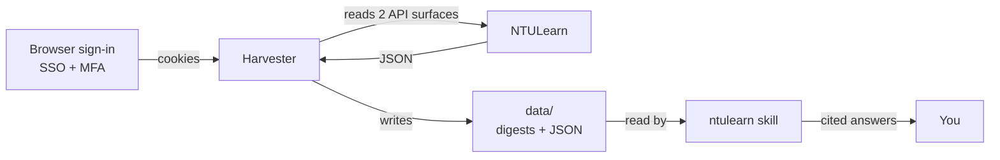

# NTULearn Course Assistant

An agent **skill** plus the **harvester** that feeds it, for answering questions about
your NTULearn (Blackboard Learn Ultra) courses from a local snapshot — instead of
clicking through the website.

Ask things like:

- *"What are the time limit, attempts and scope for the XX1234 mock quiz?"*
- *"What's due in the next two weeks?"*
- *"What did the latest announcement in XX1234 say?"*
- *"How many attempts do I have left on the Unit 1 quiz?"*
- *"What's covered in Week 5 of XX5678?"*

Answers come back with the module path, the course page link, and the snapshot
timestamp — so you can always trace a claim back to its source.

## Why this exists

NTULearn tells you *less* than you'd think at a glance. It doesn't surface, in one place:
how long a quiz runs, how many attempts you've used, or the exam scope the instructor
typed into the assessment. All of that exists in the data — the harvester pulls it out
into a readable digest.

## How it works



The harvester reads two Blackboard API surfaces that are **not interchangeable**:

| Surface | What it gives |
|---|---|
| `/learn/api/public/v1/…` | Course list, announcements. Its content and gradebook endpoints return almost nothing for Ultra courses. |
| `/learn/api/v1/…` | The undocumented surface the Ultra SPA itself calls: outline, assessment config, attempt records, marks. |

The subtle part: the outline endpoint returns assessment summaries with **blank
descriptions**, while the single-item endpoint carries the description — which is exactly
where instructors write the exam scope. The harvester calls both.

Field meanings were verified against the rendered UI, not assumed:

| API value | UI text | Conclusion |
|---|---|---|
| `deploymentSettings.timeLimit: 5` | "Time limit: 5 minutes" | the field is **minutes** |
| `deploymentSettings.attemptCount: -1` | "Attempts: Unlimited" | `-1` means **unlimited** |
| `gradingColumn.dueDate: …T15:59:00Z` | "…11:59 PM (UTC+8)" | ISO UTC, localised for display |

## No password, ever

NTU federates NTULearn to **Microsoft Entra ID with MFA**. No script can complete that
flow, and hammering a login form risks locking the account.

So authentication happens **once, by you, in a real browser**. Only the resulting session
cookies are stored, at `.auth/state.json` with mode `0600`, and that path is git-ignored.

**Your password is never requested, never read, and never written to disk.**

## Quickstart

```bash
git clone <this repo> ntulearn-skill
cd ntulearn-skill/harvester

npm install
npx playwright install chromium   # ~150 MB

npm run login     # a browser opens: sign in, complete MFA, browse a course or two
npm run harvest   # writes data/
```

Then ask your agent questions. `npm run status` tells you whether the session is still
alive without opening a browser.

## Install the skill

The skill is a directory bundle. Copy it into whichever skill root your agent scans:

| Agent | Destination |
|---|---|
| DSH | `<workspace>/.dsh/skills/ntulearn/` |
| Generic | `<workspace>/.agents/skills/ntulearn/` |

```bash
# from the workspace root
mkdir -p .dsh/skills
cp -R /path/to/ntulearn-skill/skills/ntulearn .dsh/skills/
```

Put the harvester where the skill expects to find its data, as `<workspace>/ntulearn/`,
or point `NTULEARN_HOME` at it:

```bash
cp -R /path/to/ntulearn-skill/harvester ./ntulearn
```

## Layout

```
skills/ntulearn/           the skill
├── SKILL.md               instructions the agent follows
├── references/
│   └── data-model.md      JSON schema + field semantics
└── scripts/
    └── refresh.sh         re-harvest, or say a login is needed

harvester/                 the tool that produces the snapshot
├── README.md
├── package.json
└── src/                   login / status / harvest / discover / verify

examples/
└── sample-digest.md       synthetic digest showing the output format
```

## Adapting to another institution

The Ultra endpoints in `harvester/src/lib/ultra.mjs` are generic Blackboard Learn Ultra —
only the origin and the SSO flow are NTU-specific. Change `ORIGIN` in `lib/bb.mjs`, point
`login.mjs` at your instance, and run `npm run discover` to confirm the endpoint shapes
still match.

## Responsible use

- Use this **only on your own account**. The captured session and harvested data are
  yours, and both are git-ignored by default for that reason.
- Automated access may be governed by your institution's acceptable-use policy. This
  tool reads what your account can already read, at a deliberately throttled rate — but
  it is your account and your responsibility.
- Harvested data includes **your marks and your instructors' course materials**. Do not
  publish it. If you fork this, keep `data/` and `.auth/` out of the repo.
- The snapshot is a cache, not an authority. Always confirm anything consequential
  against NTULearn itself.

## License

MIT — see [LICENSE](LICENSE).
