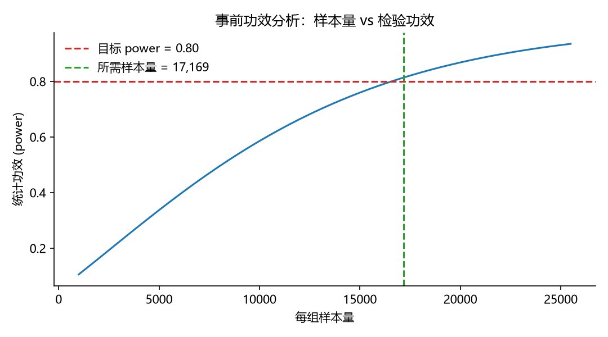
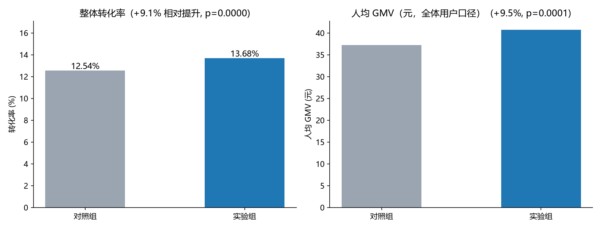
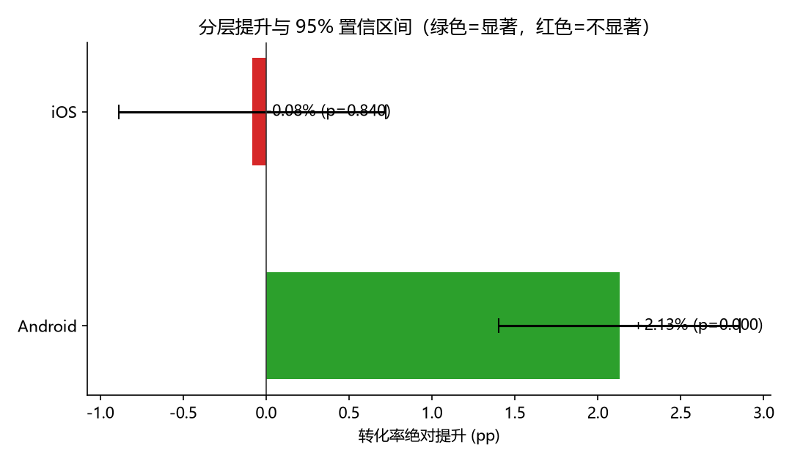
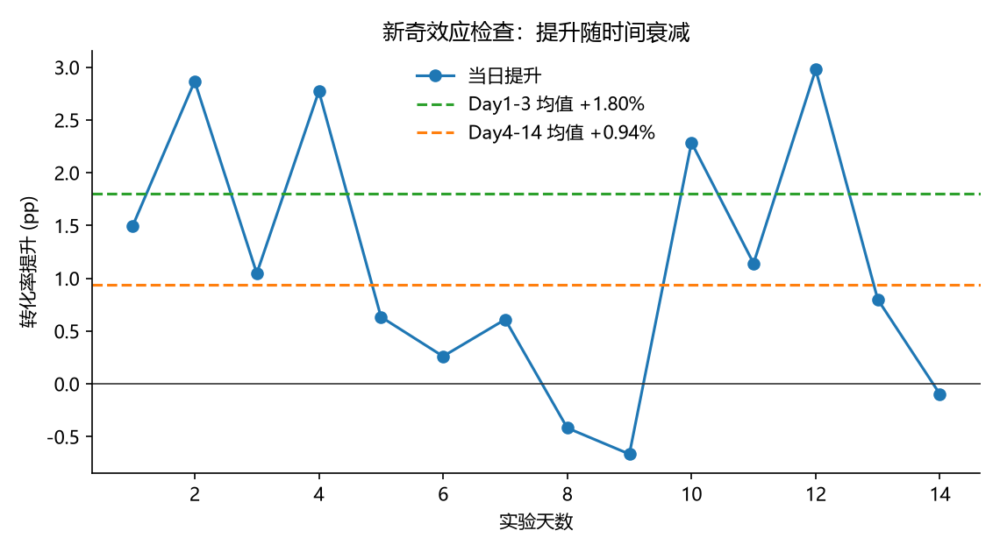

# AB 实验效果评估 —— 首页推荐位改版

一次完整的 A/B 实验分析：从"这个实验需要多少人"开始，到"到底该不该全量"结束。

> **一句话结论**：整体转化率 +1.14pp（相对 +9.1%，p < 0.0001）看起来很漂亮，
> 但拆到平台后发现 **Android +2.13pp 显著、iOS 实际上没有任何变化**，
> 且提升随时间衰减（Day1-3 +1.80pp → Day4-14 +0.94pp）。
> 结论不是"全量上线"，而是 **Android 端放量 + iOS 端继续观察**。

---

## 分析框架

| 步骤 | 做什么 | 为什么 |
|---|---|---|
| 1. 事前功效分析 | 给定 baseline 与 MDE，反推每组所需样本量 | 避免"开了实验但样本根本不够" |
| 2. 核心指标检验 | 转化率用两比例 z 检验，人均 GMV 用 Welch t 检验 | 不同指标类型用不同检验 |
| 3. 分层一致性 | 按平台拆分，看整体结论是否在每个子群都成立 | 防止辛普森悖论，防止被单一子群"抬"出来的显著 |
| 4. 新奇效应检查 | 按实验天数拆提升，看是否随时间衰减 | 短期冲高不代表长期收益 |
| 5. 落地建议 | 给放量范围、观察时长、后续实验方向 | 分析的终点是决策 |

---

## 关键结果

### 1. 事前功效分析

| 参数 | 取值 |
|---|---|
| baseline 转化率 | 12.0% |
| MDE（最小可检测提升） | 1.0pp |
| 显著性水平 α | 0.05 |
| 检验功效 power | 0.80 |
| **每组所需样本量** | **17,169 人（合计 34,338 人）** |

实际入组每组 30,000 人，样本量充足。



### 2. 核心指标假设检验

| 指标 | 对照组 | 实验组 | 绝对提升 | 相对提升 | p 值 | 95% 置信区间 |
|---|---|---|---|---|---|---|
| 转化率 | 12.54% | 13.68% | **+1.14pp** | **+9.06%** | < 0.0001 | [+0.60pp, +1.68pp] |
| 人均 GMV（全体用户口径） | ¥37.2 | ¥40.7 | **+¥3.5** | **+9.49%** | 0.0001 | [+¥1.7, +¥5.3] |

两个核心指标均达到显著水平。



### 3. 分层一致性检查 ⚠️

| 平台 | 对照组 | 实验组 | 提升 | p 值 | 结论 |
|---|---|---|---|---|---|
| Android | 12.04% | 14.17% | **+2.13pp（+17.7%）** | < 0.0001 | ✅ 显著 |
| iOS | 13.16% | 13.08% | −0.08pp（−0.6%） | 0.840 | ❌ 不显著 |

**整体 +1.14pp 的显著提升，几乎全部由 Android 端贡献；iOS 端不仅没有提升，点估计还是负的。**
如果不做这一步就直接全量，等于让一半用户承担一个对ta们无效甚至可能有害的改动。



### 4. 新奇效应检查

| 时间窗口 | 平均提升 |
|---|---|
| Day 1–3 | +1.80pp |
| Day 4–14 | +0.94pp |

提升在前三天明显高于稳态，存在典型的新奇效应衰减，说明 14 天窗口内尚未完全稳定。



---

## 最终建议

1. **不要全量**：整体显著由 Android 单端拉动，建议先在 Android 端放量，iOS 端维持原策略并单独设计实验；
2. **延长观察**：存在新奇效应衰减，建议把观察窗口拉长到 21–28 天，用稳态提升重新评估 ROI；
3. **补充指标**：本次只看转化与 GMV，建议补充留存、客诉率等护栏指标，确认没有"提转化伤体验"的副作用；
4. **样本量复盘**：本次 MDE 设为 1.0pp，若要检测 0.5pp 级别的细微提升，每组需要约 68,000 人，需评估流量成本。

---

## 如何运行

```bash
pip install -r requirements.txt
python ab_test_analysis.py
```

脚本会在 `assets/` 下生成 4 张图表，并在终端打印全部分析结论。

## 关于数据

本项目使用**本地合成的模拟数据**（`np.random.default_rng` 固定随机种子 20260912），
不含任何真实业务数据，clone 下来即可一键复现。
真实场景中只需把 `generate_data()` 替换为数仓 SQL 取数，下游分析逻辑完全复用。

数据中埋了三个"真实设定"用来检验方法是否抓得住：
- Android 有真实提升、iOS 没有
- 提升随时间衰减（新奇效应）
- GMV 与转化率的提升幅度不同

## 技术要点

- 两比例检验：pooled SE 用于检验，unpooled SE 用于置信区间
- 连续指标使用 Welch t 检验（不假设方差齐性）
- 分层分析后需注意多重比较问题：本例仅 2 个子群且 Android 的 p 值极小（< 0.0001），结论稳健；若子群数量多，应做 Bonferroni 或 BH 校正
