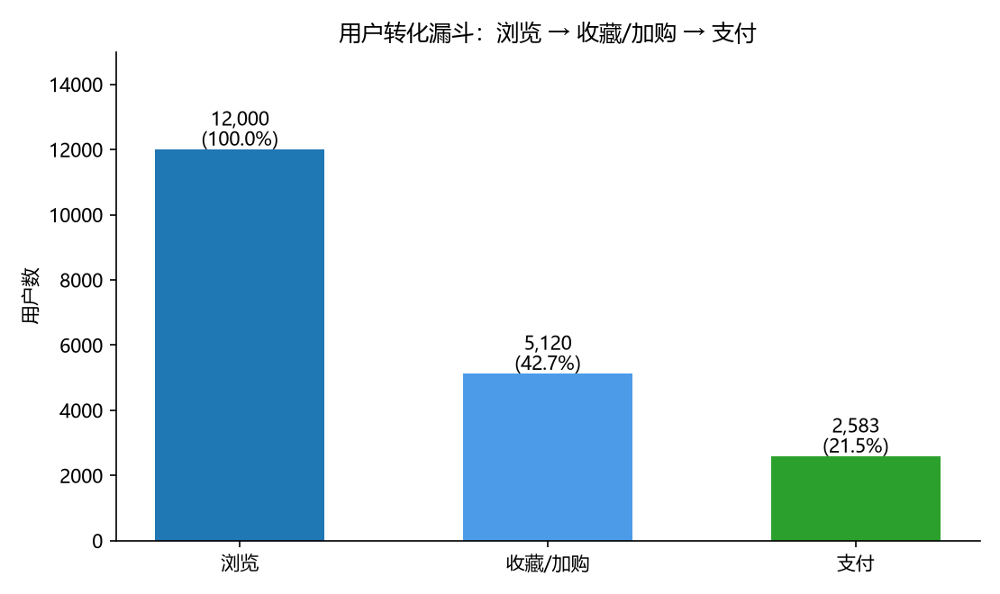
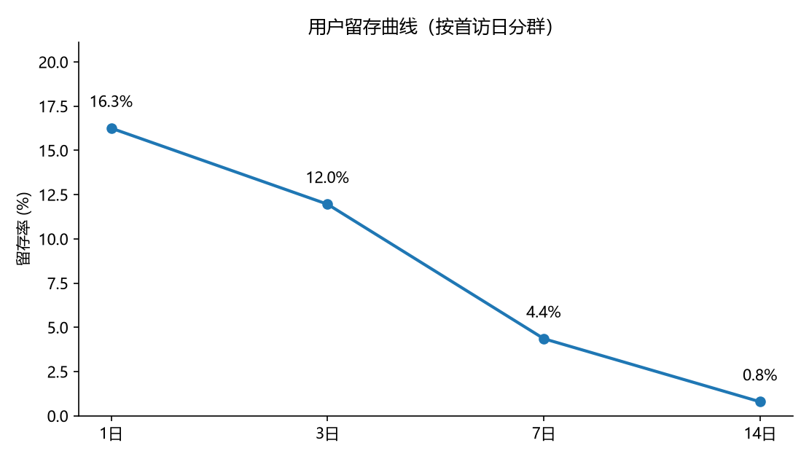
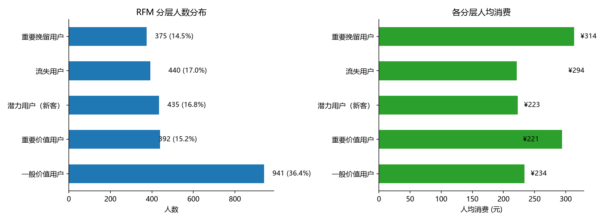
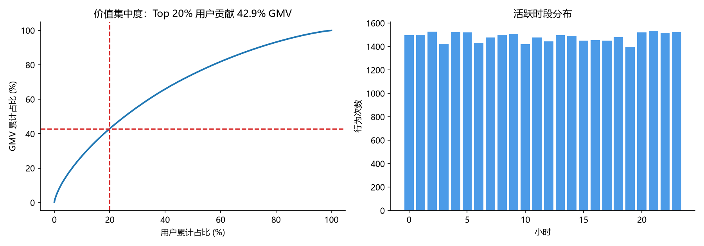

# 电商用户行为分析 —— 漏斗 / 留存 / RFM

对 12,000 名用户、35,565 条行为日志（2026-08-01 ~ 08-31）的端到端分析。

> **一句话结论**：加购到支付是最大流失点（**49.6% 的加购用户最终没有付款**），
> 次日留存仅 16.3%、7 日留存跌到 4.4%，而 **Top 20% 的用户贡献了 42.9% 的 GMV**——
> 优先级应该是「先堵支付漏斗 + 做头部用户留存」，而不是继续拉新。

---

## 数据概览

| 项目 | 数值 |
|---|---|
| 行为记录 | 35,565 条 |
| 用户数 | 12,000 人 |
| 时间跨度 | 2026-08-01 ~ 2026-08-31 |
| 行为类型 | 浏览 21,933 ｜ 加购 6,625 ｜ 收藏 4,010 ｜ 支付 2,997 |

---

## 1. 转化漏斗

| 环节 | 用户数 | 整体转化率 | 环节转化率 |
|---|---|---|---|
| 浏览 | 12,000 | 100.0% | — |
| 收藏 / 加购 | 5,120 | 42.7% | 42.7% |
| 支付 | 2,583 | 21.5% | **50.4%** |

**支付环节流失 2,537 人，占加购用户的 49.6%** —— 这是整个链路里最大的漏点。



## 2. 留存分析（按首访日分群）

| 留存天数 | 留存率 |
|---|---|
| 次日 | 16.3% |
| 3 日 | 12.0% |
| 7 日 | 4.4% |
| 14 日 | 0.8% |

次日留存跌到 16.3% 后，7 日只剩 4.4%，说明新客在首次访问后迅速流失，
**首访体验（首屏内容相关性、新人引导）比后续召回更值得投入**。



## 3. RFM 用户分层

| 分层 | 人数 | 占比 | 人均消费 |
|---|---|---|---|
| 一般价值用户 | 941 | 36.4% | ¥234 |
| **重要价值用户** | 440 | 17.0% | ¥294 |
| 潜力用户（新客） | 435 | 16.8% | ¥223 |
| 流失用户 | 392 | 15.2% | ¥221 |
| 重要挽留用户 | 375 | 14.5% | **¥314** |

值得注意：**重要挽留用户（曾高频消费但已沉寂）人均消费最高（¥314）**，
高于重要价值用户，是高 ROI 的召回对象。



## 4. 价值集中度与活跃时段

- **Top 20% 用户贡献 42.9% 的 GMV**，接近但略低于经典的 80/20 法则
- 活跃高峰集中在**晚间 19–22 点**，运营资源（客服、推送、活动开奖）应向该时段倾斜



---

## 行动建议

| 优先级 | 动作 | 依据 |
|---|---|---|
| P0 | 优化支付链路（运费/优惠券门槛、支付失败重试、库存提示） | 49.6% 加购未支付，是最大漏点 |
| P0 | 针对「重要挽留用户」做定向召回 | 该层人均消费最高（¥314），召回 ROI 最高 |
| P1 | 首访体验优化（新人券、首屏个性化） | 次日留存仅 16.3%，7 日跌至 4.4% |
| P2 | 活动与推送集中在 19–22 点 | 该时段为活跃高峰 |

---

## 如何运行

```bash
pip install -r requirements.txt
python ecommerce_user_analysis.py
```

脚本会在 `assets/` 下生成 4 张图表，并在终端打印全部分析结论。

## 关于数据

本项目使用**本地合成的模拟数据**（固定随机种子 20260912），
不含任何真实用户数据，clone 下来即可一键复现。
真实场景中把 `generate_events()` 替换为数仓 SQL 取数即可，下游分析逻辑完全复用。

## 方法说明

- **漏斗**：按用户去重统计各环节的独立用户数（不是事件数），避免同一用户多次浏览被重复计数
- **留存**：cohort 口径，按用户首次活跃日期分群，计算第 N 日仍活跃的比例
- **RFM**：R / F / M 各按五分位打分 1–5（R 反向计分），再按 R、F 组合划分为 5 类人群
- **帕累托**：按用户累计消费降序，计算累计 GMV 占比曲线
